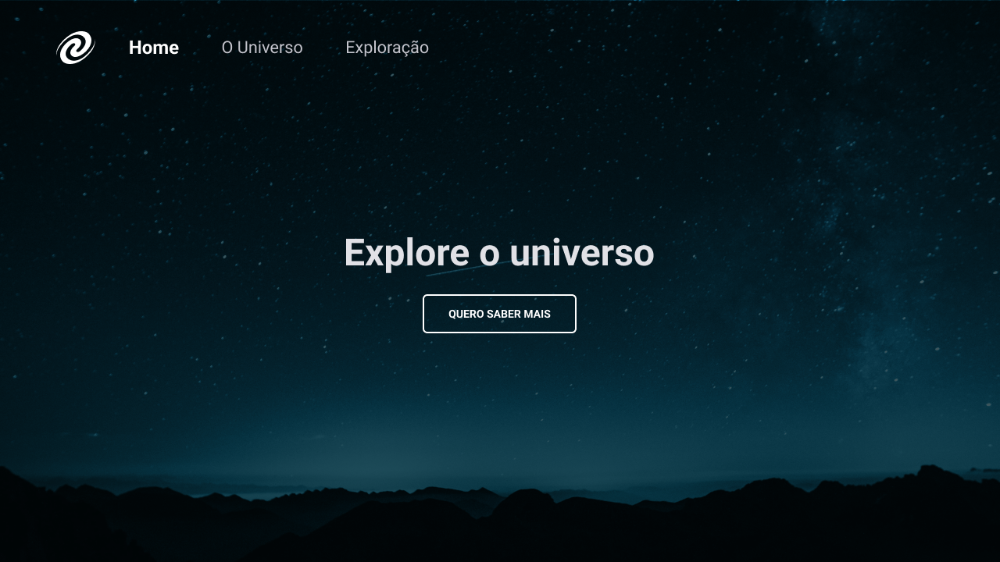

# SPA Universe - Stage 6 - Explorer

> SPA Universe

O que será abordado nesse desafio:

- Conceitos de SPA;
- Mapeamento de rotas;
- Assíncrono e promises;
- Orientação a objetos;
- Classes e muito mais.

[🔗 Clique aqui para acessar](https://github.com/gabrieltrabalon/EXERCICIO-2---STAGE4)

## 🛠️ Tecnologias

- HTML
- CSS
- JavaScript
